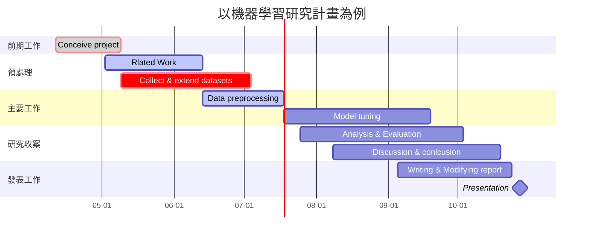
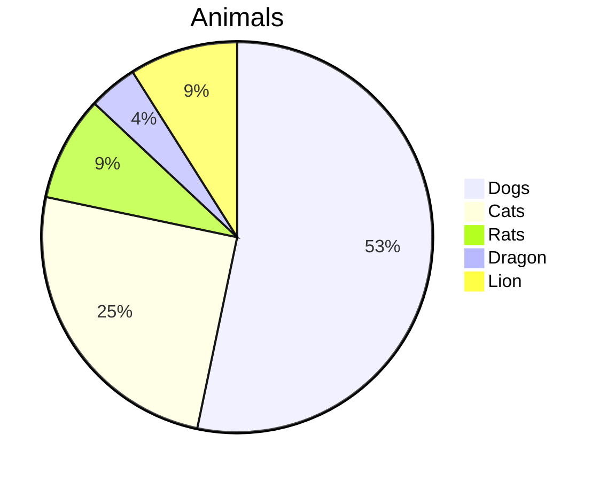
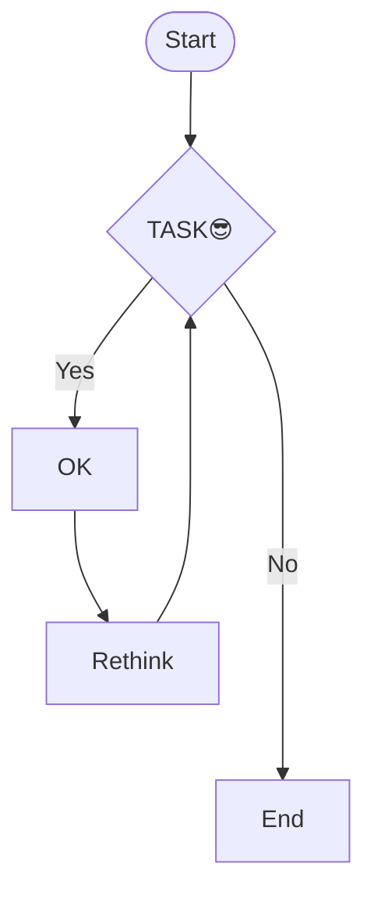
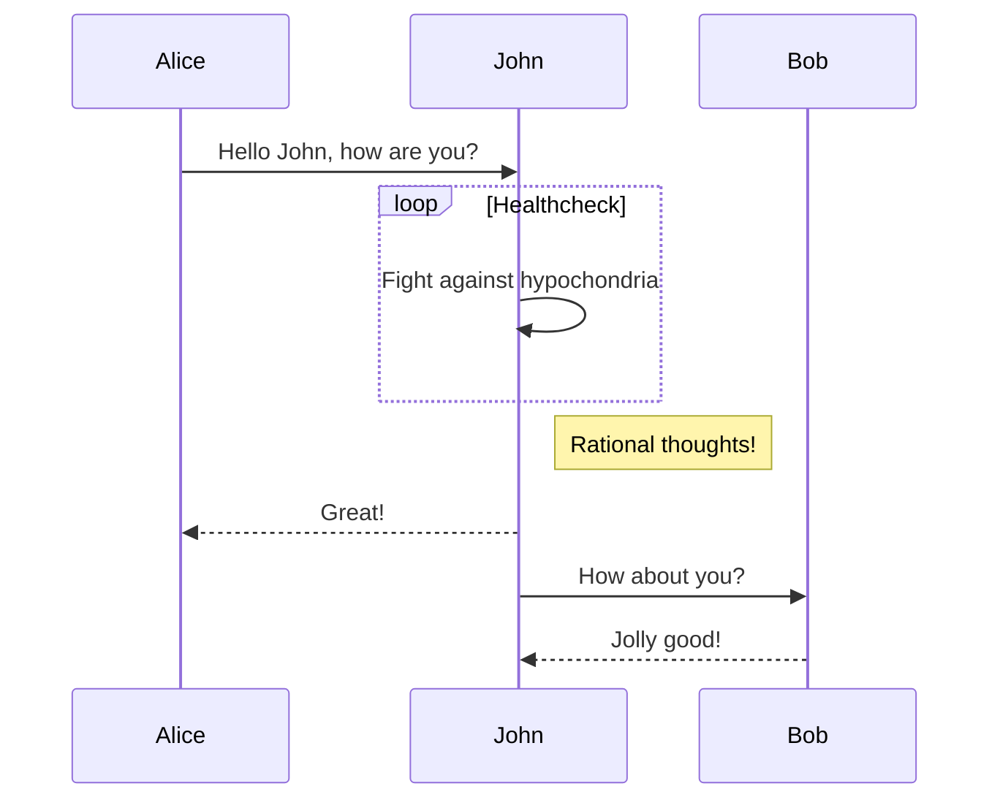
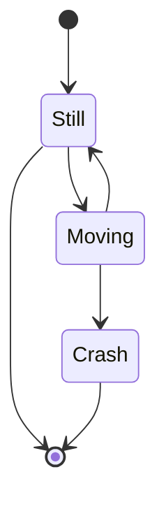
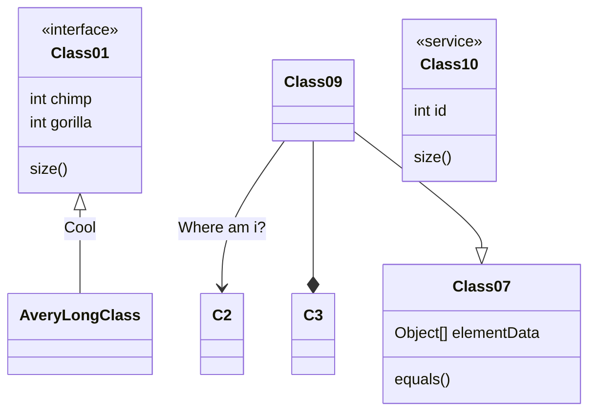

# Markdown圖表 社課實作示範

> Created by 王修佑 (GitHub [@whyhugo](https://github.com/whyhugo))<br>
> [GitHub README.md](https://github.com/whyhugo/Handouts/blob/main/Markdown%E5%9C%96%E8%A1%A8%E5%AF%A6%E4%BD%9C.md)<br>
> [HackMD](https://hackmd.io/@whyhugo/rkMEGXnH9)

### 2022/04/29 社課X 
## Gantt Chart
- 可用於顯示專案、進度以及其他與時間相關的系統進展的內在關係隨著時間進展情況的圖表，現今被相當廣泛的運用。


👉[開啟HackMD雙欄模式檢視原始語法](https://hackmd.io/T-UpzCz-QV-AMSDCmXIVUw?both)  
- 原始碼Open Code
````

````
### 👍好站推薦
- [如何繪製甘特圖](https://hackmd.io/@hackmd-marketing/draw-gantt?utm_source=twitter&utm_medium=post-link)
- [Mermaid.js document](https://mermaid-js.github.io/mermaid/#/gantt)

## Pie Chart
👉[開啟HackMD雙欄模式檢視原始語法](https://hackmd.io/T-UpzCz-QV-AMSDCmXIVUw?both)

- 原始碼Open Code
````

````
### 👍好站推薦
- [畫圖真的好簡單](https://hackmd.io/c/tutorials-tw/https%3A%2F%2Fhackmd.io%2F%40docs%2Fmermaid_pie?fbclid=IwAR0dQVb-373PL-57PhsdOWoOFYgh2j1JrA78hwTzD6NP92q6XY90X9jD5g0)

## Flow Chart
👉[開啟HackMD雙欄模式檢視原始語法](https://hackmd.io/T-UpzCz-QV-AMSDCmXIVUw?both)

- 原始碼Open Code
````

````
## Sequence Diagram
👉[開啟HackMD雙欄模式檢視原始語法](https://hackmd.io/T-UpzCz-QV-AMSDCmXIVUw?both)

- 原始碼Open Code
````

````
## State Diagram
👉[開啟HackMD雙欄模式檢視原始語法](https://hackmd.io/T-UpzCz-QV-AMSDCmXIVUw?both)

- 原始碼Open Code
````

````
## Class Diagram
👉[開啟HackMD雙欄模式檢視原始語法](https://hackmd.io/T-UpzCz-QV-AMSDCmXIVUw?both)

- 原始碼Open Code
````

````


###### tags: `zfcsc`

